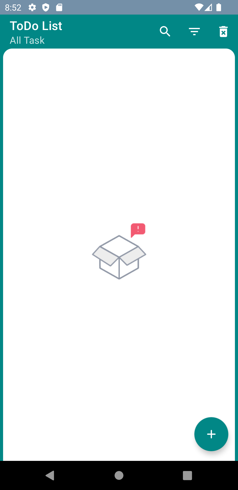
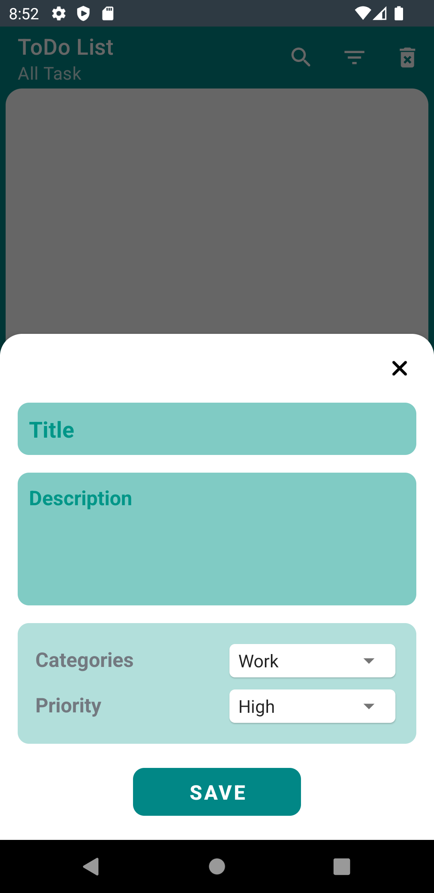
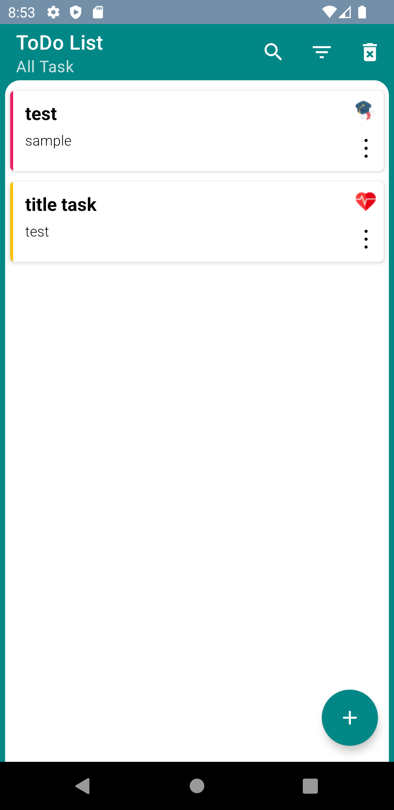
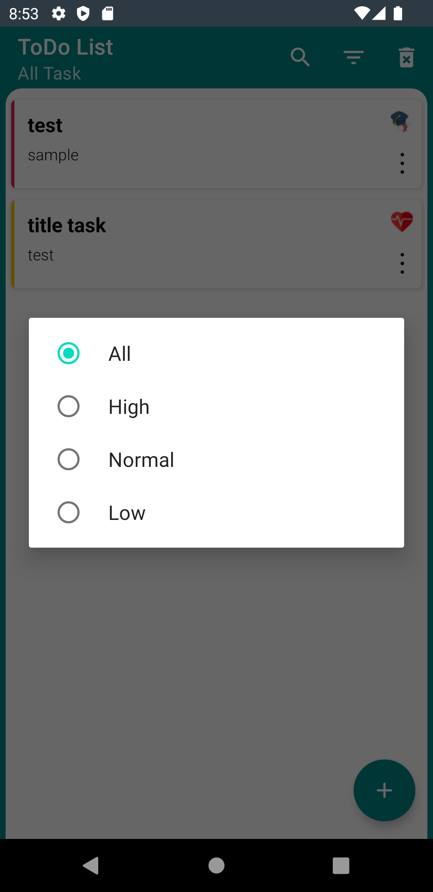
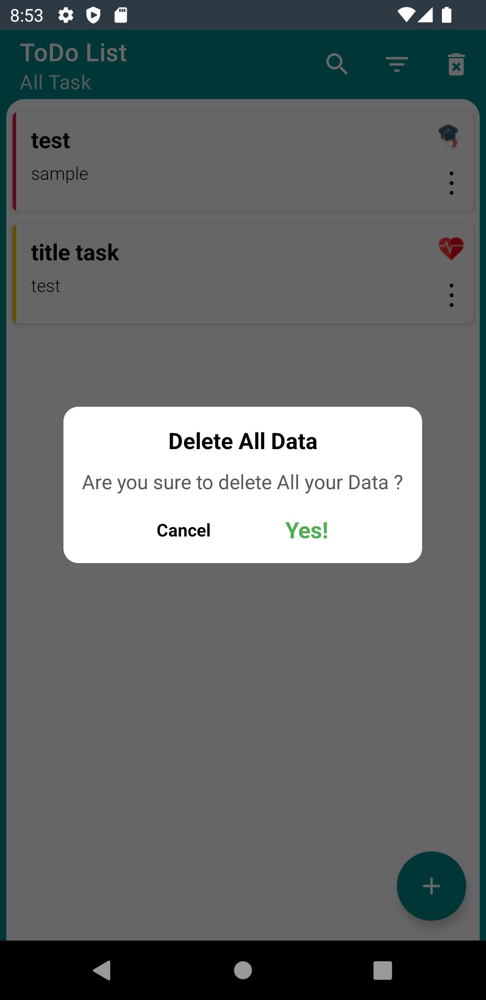

# SimpleTaskApp-MVI

Overview :
 
The purpose of this project series is to teach different architectures with different structures, and you can check these architectures and structures in same App

** coming soon on AndroidGeek(https://www.youtube.com/c/AndroidGeekco) youtube channel **

This project in
- MVP architecture : https://github.com/ezatpanah/SimpleTaskApp-MVP [ Room Database - RxJava - Dagger Hilt - Lottie - View Binding ]
- MVVM architecture : https://github.com/ezatpanah/SimpleTaskApp-MVVM [ Room Database - LiveData - Flow - Coroutines - Dagger Hilt - ViewModel - Lottie - View Binding ]
- MVI architecture : Current Repo 

The app was written in Kotlin.

 
Technologies and Libraries Used :

- Room Database
- Flow
- StateFlow
- Dagger Hilt
- Coroutines
- Lottie
- View Binding

Screen-Shot :
 
    
